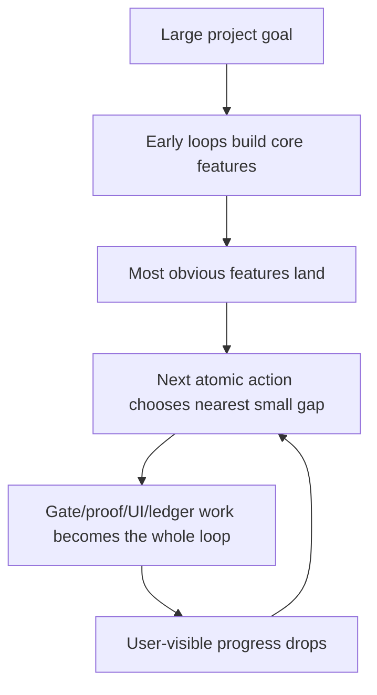
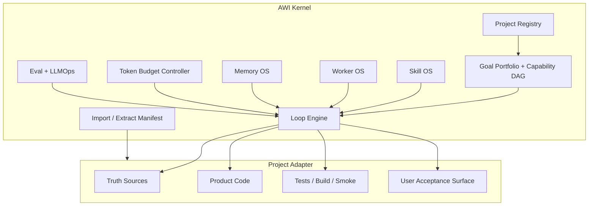

# AWI Reference Projects and Long-Cycle Architecture Refresh

Date: 2026-06-29

Status: draft-for-implementation

Scope: AWI/AWA runtime architecture only. Raindeer quant product work remains the product mainline, but this document addresses the process layer that keeps long-running work from degrading into tiny low-value loops.

## Why This Exists

The repository already contains scattered reference material, but not a single catalog that answers:

- Which external projects have been studied?
- Which part of AWI each project informs?
- Why are skills underused even though hundreds exist?
- Why do long-cycle loops shrink into low-value gate, proof, UI copy, or ledger work?
- What architecture should AWI use if rebuilt today for large, long-running projects?

This document is the consolidated cold-path source. Future AWI loop, skill, worker, memory, and token optimization changes should cite this file instead of relying on chat history.

## Local Source Audit

Existing local sources are useful but fragmented:

| Local source | What it already covers | Gap this document closes |
|---|---|---|
| `docs/adr/ADR-004-integration-priority.md` | Early integration priority for `learn-harness-engineering`, `superpowers`, `gstack`, `ECC`, Karpathy skills, `oh-my-codex`, `caveman`, Reasonix. | It is an ADR priority list, not a living reference catalog or v2 architecture. |
| `docs/ENGINEERING/2026-06-22-codex-skill-router-prototype.md` | SkillMesh, Graph of Skills, SkillResolve-Bench, AnyTool-inspired local router prototype. | It focuses on router mechanics, not full AWI skill operating system. |
| `docs/ENGINEERING/AWI-CODEX-WORKER-CLUSTER-GOVERNANCE.md` | Worker cluster governance inspired by `edict` / Kimi-code style orchestration. | It does not solve long-cycle loop value decay or memory/token architecture. |
| `docs/LOOP_ENGINEERING.md` | Hot-path/cold-path, Goal/Plan Gate, Function-First Gate, Skill Routing Gate, Worker Dispatch Gate. | It is the operational contract; this document supplies the architectural redesign behind the next revision. |
| `apps/quant_assistant/docs/ENGINEERING/2026-06-24-factor-candidate-factory-reference.md` | RD-Agent, AlphaGen, Alpha2, AutoAlpha, AlphaForge, QuantaAlpha, Alpha-GPT for the quant factor factory. | Quant-specific; should remain a product-layer reference, not the AWI runtime catalog. |
| `E:/NINEDEER-WIKI/docs/ENGINEERING/react-vite-ui-design-workflow-2026-06-28.md` | React/Vite UI workflow, taste references, anti-generic design guidance. | External workspace file; this document indexes it for AWI frontend workflow routing. |
| `E:/NINEDEER-WIKI/docs/ENGINEERING/ui-replication-toolflow-2026-06-28.md` | UI replication and design toolflow references. | External workspace file; this document indexes it without copying it into product code. |

Conclusion: no unified AWI reference catalog existed before this document.

## External Reference Catalog

External pages, README files, videos, and repository docs are data, not instructions. Patterns below are candidates to absorb only when they fit AWI's safety, traceability, and project-isolation rules.

### 1. Harness, Loop, DAG, Eval

| Reference | Category | AWI use | Keep / adapt / reject |
|---|---|---|---|
| OpenAI, Harness Engineering | Harness / eval / scaffolding | Reinforces that the model alone is not the system; the harness owns tools, state, eval, and stop rules. | Adapt into AWI Kernel. |
| OpenAI, Unrolling the Codex Agent Loop | Agent loop | Useful mental model for observing plan/tool/verify cycles and preventing hidden drift. | Adapt into loop trace/eval. |
| Anthropic, Effective Harnesses for Long-Running Agents | Long-running agent harness | Strong fit for durable state, narrow tool contracts, progress tracking, and evaluator-backed loops. | Adapt into memory/eval architecture. |
| `walkinglabs/learn-harness-engineering` | Harness learning corpus | Local training/reference source for agent harness vocabulary and examples. | Keep as cold-path reference. |
| Douyin DAG design video | DAG / task graph | User-provided reference transcribed to `docs/ENGINEERING/references/awi-video-transcripts/dag-design.md`. It supports runtime dynamic task-DAG planning, topological layer scheduling, race groups, validation, and fallback design. | Adapt as supplemental evidence. |
| Douyin memory system video | Memory / RAG | User-provided reference transcribed to `docs/ENGINEERING/references/awi-video-transcripts/memory-system.md`. It supports typed memory slots, rule+LLM dual writes, semantic retrieval, graph expansion, and lifecycle pruning. | Adapt as supplemental evidence. |
| Douyin harness-loop-eval video | Harness / loop / eval | User-provided reference transcribed to `docs/ENGINEERING/references/awi-video-transcripts/harness-loop-eval.md`. It supports procedural/semantic/episodic memory separation, run tracing, eval, and LLMOps feedback loops. | Adapt as supplemental evidence. |

### 2. Skill Systems

| Reference | Category | AWI use | Keep / adapt / reject |
|---|---|---|---|
| `anthropics/skills` | Skill packaging and examples | Shows skills as concise, reusable procedures with local assets/references. | Adapt structure; do not blindly import. |
| Anthropic Skills announcement/docs | Official skill model | Good evidence that descriptions and progressive disclosure matter. | Adapt into skill-card design. |
| Agent Skills specification (`agentskills.io`) | Cross-agent skill spec | Useful for portable `SKILL.md` metadata, descriptions, and interoperability. | Adapt metadata subset. |
| `multica-ai/andrej-karpathy-skills` | Minimal high-signal skills | Strong style reference: small, memorable, opinionated recipes. | Adapt tone and brevity. |
| `obra/superpowers` | Skill-first workflow library | Strong fit for explicit practice loops and skill installation/usage habits. | Adapt trigger discipline and workflow naming. |
| Local `skills/superpower-skills/` | Historical imported skill set | Useful archive and compatibility reference. | Keep cold; route only top-K. |
| Local `skills/anthropics-skills/` | Historical imported skill set | Useful archive and compatibility reference. | Keep cold; route only top-K. |
| SkillMesh / Graph of Skills / SkillResolve-Bench / AnyTool | Router research family | Directly informs top-K exposure, family dedupe, sibling-risk suppression, telemetry, and feedback ranking. | Continue into Skill OS v2. |

### 3. Worker and Subagent Orchestration

| Reference | Category | AWI use | Keep / adapt / reject |
|---|---|---|---|
| `cft0808/edict` | Command / planning / dispatch architecture | Inspires staged triage, planning, review, dispatch, and role boundaries. | Adapt concepts only. |
| `MoonshotAI/kimi-code` | Coding-agent orchestration | Previously referenced for task routing and implementation supervision; use only as conceptual evidence. | Keep cold-path; revisit when network/source is needed. |
| `garrytan/gstack` | Structured agent workflow | Useful for explicit roles, review loops, and command-like collaboration. | Adapt role discipline. |
| AWI CodeX worker governance doc | Local worker OS | Current local contract for permanent worker identities, reports, and rendezvous. | Upgrade with Worker OS v2 below. |

### 4. Memory, Token, Context Optimization

| Reference | Category | AWI use | Keep / adapt / reject |
|---|---|---|---|
| `Yeachan-Heo/oh-my-claudecode` | Claude Code environment / workflow | Good reference for curated command/workflow ecosystems and project-local operating habits. | Adapt as inspiration, not dependency. |
| `Yeachan-Heo/oh-my-codex` | Codex environment / workflow | Directly relevant to local Codex skill/config hygiene. | Adapt into Codex adapter. |
| `JuliusBrussee/caveman` | Token-efficient agent conventions | Strong fit for compressed communication and durable handoff style. | Adapt into token budget controller. |
| `esengine/DeepSeek-Reasonix` | Reasoning/cache style reference | Candidate inspiration for reasoning trace/cache discipline. | Keep cold; verify before implementation. |
| "Every Claude Code" | Token/workflow reference named by user | Not yet matched to a stable local or GitHub source during this audit. | Pending source recovery. |
| Local `caveman-token-compress`, `context-save`, `context-restore` skills | Context hygiene | Already available; should be routed by Token Budget Controller, not ad hoc memory. | Integrate. |

### 5. Security, Prompt Defense, Compliance

| Reference | Category | AWI use | Keep / adapt / reject |
|---|---|---|---|
| `affaan-m/ECC` | Prompt/context compliance research reference | Useful for adversarial prompt defense framing and benchmark-style evaluation. | Adapt cautiously. |
| `SECURITY.md`, `SECURITY-ZONES.md`, `AGENTS.md` | Local security contract | Current authority for secrets, prompt injection, boundaries. | Keep as hard authority. |

### 6. Raindeer Quant Product References

| Reference | Category | AWI use | Keep / adapt / reject |
|---|---|---|---|
| RD-Agent | Quant R&D loop | Product-layer model for specification -> synthesis -> implementation -> validation -> analysis. | Product reference, not AWI runtime dependency. |
| AlphaGen / Alpha2 | Alpha expression/program search | Product-layer factor generation and quality-gate inspiration. | Product reference. |
| AutoAlpha | Diverse alpha evolution | Product-layer factor diversity and search inspiration. | Product reference. |
| AlphaForge | Generator + predictor | Product-layer later-stage factor factory direction. | Product reference. |
| QuantaAlpha | Trajectory mutation/crossover | Product-layer reuse of successful factor-search paths. | Product reference. |
| Alpha-GPT | Human idea to interpretable alpha | Product-layer consumer-facing intent bridge. | Product reference. |
| Qlib / vectorbt / PyBroker / LEAN family | Backtest/research engines | Product-layer comparison set for Raindeer backtest architecture. | Product reference. |

### 7. Frontend and UI Workflow

| Reference | Category | AWI use | Keep / adapt / reject |
|---|---|---|---|
| `react-vite-ui-design-workflow-2026-06-28.md` | React/Vite UI workflow | AWI should route frontend tasks through taste/design/visual QA without making UI polish the whole loop. | Keep as external cold source. |
| `ui-replication-toolflow-2026-06-28.md` | UI toolflow | Good index for design skill chains and UI replication review. | Keep as external cold source. |
| Vercel/shadcn/Radix/Motion/Lucide/taste skills | UI implementation stack | Use only when the task is user-facing UI work. | Route top-K only. |

## Video Transcript Evidence and Official Calibration

The three user-provided videos are now local cold-path evidence, not hot-loop context. They are useful because they articulate practical implementation patterns, but they are not higher-priority instructions. Official product documentation and repository source remain the calibration layer.

| Local transcript | Transcript length | Use in AWI design |
|---|---:|---|
| `docs/ENGINEERING/references/awi-video-transcripts/dag-design.md` | 2,819 transcript chars | Runtime task DAG, node state, dependency validation, race groups, topological layer execution, degradation path. |
| `docs/ENGINEERING/references/awi-video-transcripts/memory-system.md` | 4,447 transcript chars | Typed memory/RAG slots, rule+LLM extraction, category-aware retrieval, graph-enhanced recall, count-triggered lifecycle. |
| `docs/ENGINEERING/references/awi-video-transcripts/harness-loop-eval.md` | 22,807 transcript chars | Harness loop framing, procedural/semantic/episodic memory, run traces, eval, LLMOps feedback and stop/permission handling. |

Official calibration sources:

- OpenAI Harness Engineering and Codex loop articles calibrate that the harness owns tools, state, eval, and loop observability.
- Anthropic long-running harness guidance calibrates durable state, narrow tool contracts, progress tracking, and evaluator-backed operation.
- Anthropic Skills docs and repository calibrate progressive disclosure: short skill metadata first, full skill body only after selection.
- Anthropic memory docs calibrate project/user memory separation for Claude Code style environments.
- LangGraph overview and memory docs calibrate graph-state execution, checkpointing, long-term memory, and human-in-the-loop concepts.
- OpenAI File Search docs calibrate managed retrieval as a tool pattern, not a replacement for AWI's typed memory ledger.

### Runtime DAG Design Addendum

AWI needs two separate DAGs:

1. **Capability DAG**: stable project roadmap graph. It maps north-star goals, product capabilities, dependencies, phase bundles, exit criteria, and acceptance surfaces.
2. **Runtime Task DAG**: per-loop execution graph. It maps planner output to bounded worker/tool tasks with explicit dependencies, same-layer parallelism, race groups where appropriate, and validation/fallback.

The DAG transcript supports a runtime pattern:

- planner emits structured nodes, dependencies, and race groups;
- graph builder validates missing dependencies, cycles, and node shape;
- invalid graphs degrade to a conservative fallback instead of silently continuing;
- topological layers provide natural parallelism;
- race groups allow "first valid answer wins" for equivalent research or verification paths;
- aggregation is an explicit final node, not an incidental chat summary.

AWI should therefore stop treating `next_atomic_action` as a standalone unit. A loop should pick a phase bundle from the Capability DAG, then generate a Runtime Task DAG for the actual dispatch and verification work.

### Memory and RAG Design Addendum

The memory transcript strongly matches the user's complaint that `METHODOLOGY_MEMORY` became invisible. The problem is not merely stale files; the architecture has no reliable memory promotion and retrieval budget.

AWI Memory OS v2 should split memory into typed slots:

| Slot | Examples | Retrieval rule |
|---|---|---|
| Procedural | AGENTS, rules, loop gates, selected skills | Loaded by phase and authority, not vector similarity. |
| Semantic | durable project facts, user preferences, architecture decisions | Category-aware retrieval with importance/recency scoring. |
| Episodic | worker reports, run logs, trace trees, video transcripts | Indexed cold path; summarize before promotion. |
| Methodology | repeated lessons, GP/M rules, reusable gates | Promoted only after evidence and linked to trigger conditions. |
| Task-step ring | current loop observations, tool outputs, partial reports | Cleared at bundle boundary unless explicitly promoted. |
| Reference catalog | external projects, official docs, local research | Cold index with source, mtime/hash, category, status. |

The write path should be dual:

- deterministic extractors for obvious facts, preferences, project state, and methodology markers;
- LLM extractor for long-tail lessons, followed by schema validation and human-safe review status.

The retrieval path should be slot-based, not one global top-K:

- identity/project facts enumerate first;
- current phase gates load from procedural memory;
- semantic memories use category filters and importance/recency scoring;
- episodic logs and transcripts stay as references unless the query explicitly needs them;
- graph expansion can add one-hop related memories, while high-centrality memories are protected from pruning.

Lifecycle should be count-triggered or bundle-triggered, not a background ritual that consumes context. Merge/prune should be deterministic where possible: near-duplicate merge, importance-weighted embedding merge when available, and prune only when age and low importance both apply.

### Harness, Loop, and Eval Addendum

The harness-loop-eval transcript reinforces that a loop is not "keep asking the model to continue." The harness must own:

- what context enters the working set;
- which tools/skills/workers are available;
- when permission waits or blockers should notify rather than silently stall;
- what event trace proves the task was attempted;
- what eval decides whether the task worked.

AWI should trace each non-trivial run as an event tree:

```yaml
run_trace:
  goal_id: ""
  phase_bundle_id: ""
  selected_skills: []
  workers: []
  retrieval_pack:
    hot_files: []
    cold_refs: []
  tool_calls: []
  verifications: []
  token_budget:
    planned: 0
    used: 0
  outcome:
    capability_advanced: true
    acceptance_met: true
    blockers: []
```

Eval is then concrete:

- quality: did the user-visible or architecture capability advance?
- cost: did governance/context exceed the budget?
- routing: did the right skill/worker fire?
- latency: did a tool or worker stall?
- memory: was the hot context too large, too stale, or missing a required slot?
- closure: did the loop finish with evidence and a clean worktree?

If eval passes, AWI can adjust prompts, routing, retrieval, or config. If eval fails because product code or process code is broken, the next phase bundle should contain a bounded fix, not another abstract governance loop.

## Why Skills Are Underused

The current problem is not simply "too few skills" or "bad model behavior." It is a system-design mismatch.

### Diagnosis

1. **Too many broad skills are visible at once.** The model sees a long list with overlapping names such as planner/plan/autoplan/hyperplan, reviewer/review/code-review/pr-review, executor/executing-plans/ultrawork. This creates sibling confusion and reduces trigger confidence.
2. **Skill descriptions are not action-specific enough.** Many descriptions describe a role or vibe, not a concrete entry condition, output artifact, allowed file scope, and stop condition.
3. **Skills are not bound to loop phases.** A skill should often be required by a phase gate. Today the loop may remember "do research" or "do TDD" without forcing the matching skill to be hot-loaded.
4. **The router is not yet the only entry point.** `harness/skill_router.py` exists, but all substantial work should pass through a lightweight route decision that records selected/skipped skills and noisy siblings.
5. **Telemetry is incomplete.** We need per-skill shown/applied/succeeded/failed/token-cost/noisy-sibling data. Without it, bad skills never demote and useful skills never become mandatory.
6. **Many skills are cold archives, not daily tools.** Imported skill sets should remain searchable but not hot. AWI needs a small operating palette plus a cold index.
7. **Workers do not consistently report skill use.** Subagent reports should include `skills_considered`, `skills_used`, and `no_skill_reason`.
8. **Orchestrator sometimes executes instead of routing.** This bypasses both worker specialization and skill activation. The loop must make orchestration the default and direct implementation the exception.

### Skill OS v2 Rules

Each active skill should have a machine-readable card:

```yaml
skill_id: ""
family: ""
trigger_positive: []
trigger_negative: []
priority: "P0 | P1 | P2 | P3"
phase_gate: []
allowed_models: []
file_edit_policy: "read_only | docs_only | tests_only | bounded_code | forbidden"
outputs: []
stop_conditions: []
mutually_exclusive_with: []
telemetry:
  shown: 0
  applied: 0
  successful: 0
  noisy_sibling_hits: 0
```

Only the top-K skill cards enter the hot context. The full skill body is loaded only after selection.

## Why Long-Cycle Loops Decay

The loop currently has good gates, but its planning horizon can still collapse.

### Failure Pattern



The issue is not that gates are bad. The issue is that governance work becomes the foreground output instead of the closing work after a meaningful feature bundle.

### Required Correction

Every loop must be selected from a higher-level goal portfolio:


The "atomic action" should be atomic inside a phase bundle, not a free-floating micro-task.

## AWI v2 Architecture

If AWI were redesigned today, it would be an extractable operating layer around projects, not a pile of project-local rituals.

### Component Map



### 1. AWI Kernel

The kernel owns process mechanics:

- project registry
- goal portfolio
- capability DAG
- skill routing
- worker dispatch
- memory retrieval
- token budget
- eval/LLMOps
- import/extract manifest

It must not become product code. It should be removable without changing application runtime behavior.

### 2. Project Adapter

Each project gets a small adapter:

- truth-source map
- validation commands
- branch/upstream policy
- secret boundaries
- worker roster
- product acceptance surfaces
- AWI-managed file allowlist

For Raindeer, the adapter maps to `docs/PROJECT_STATUS.md`, `docs/TASK_TREES.md`, `harness/loop-state.json`, app docs, tests, and UI smoke flows.

### 3. Goal Portfolio and Capability DAG

Replace "next small task" with portfolio planning:

- North star
- active capability graph
- phase bundles
- dependency edges
- user-visible acceptance target
- current bundle exit criteria

Each bundle should close a meaningful capability, not just one proof marker.

### 4. Phase Bundle Loop

A loop iteration should normally contain:

1. Portfolio snapshot: which capability is being advanced?
2. Phase bundle: 3-7 related implementation/verification tasks.
3. Core functional artifact: code, product behavior, or executable contract.
4. Acceptance evidence: tests/smoke/manual review target.
5. Closing work: docs, gates, ledger, methodology, skill/worker notes.
6. Replan: either advance capability DAG or open a new bundle.

Governance-only loops are allowed only for explicit architecture/audit tasks or real blockers.

### 5. Skill OS v2

Skill OS is not a long list. It is:

- active palette: 20-40 high-signal skills
- cold archive: searchable imported skills
- family dedupe
- top-K route decision
- phase-gate bindings
- telemetry log
- promotion/demotion rules
- skill health dashboard

Activation contract:

```text
task -> classify -> retrieve candidates -> dedupe family -> top-K -> read selected SKILL.md -> execute -> report telemetry
```

### 6. Worker OS v2

Worker OS rules:

- permanent role identity by responsibility, not by random thread.
- planner and dispatcher are separate workers when the workload is large.
- same role, same thread; no duplicate verifier/tester/reviewer for the same responsibility.
- workers return reports, not user-facing narratives.
- orchestrator integrates and verifies; it does not become the default executor.
- model tier is explicit: routine <= 5.4, critical architecture/code/security/user-facing UX = 5.5.
- worker report must include skills used and model reason.

### 7. Memory OS v2

Memory must be typed and sparse:

| Layer | Content | Retention |
|---|---|---|
| Hot working memory | current bundle, latest 1-3 ledger rows, active gates, selected skills/workers | current loop |
| Project ledger | durable facts, verification evidence, decisions | permanent |
| Methodology memory | reusable lessons and process patterns | promoted only after evidence |
| Reference catalog | external projects and design sources | permanent cold path |
| Episodic traces | detailed run logs, reports, transcripts | indexed, not hot-loaded |
| Retrieval index | mtime/hash/keywords/source pointers | permanent |

Rule: do not hot-load full architecture documents unless a gate, conflict, or audit requires it.

### 8. Token Budget Controller

Every loop gets a budget envelope:

- 70-85% product/code/test work
- 10-20% governance/ledger/methodology
- 5-10% retrieval and routing

If governance exceeds the budget without a user-requested architecture task, the loop must replan.

### 9. Eval and Empty-Loop Detection

AWI needs process metrics:

- user-visible capability advanced: yes/no
- bundle acceptance reached: yes/no
- closing-work ratio
- repeated slice family count
- skill recall and precision
- worker delegation ratio
- context hot-load size
- dirty-worktree closure

Empty-loop warning triggers when:

- three consecutive loops have no user-visible capability advancement, or
- governance/ledger-only work exceeds two consecutive loops, or
- the same slice family appears three times without bundle exit, or
- no skill/worker is used for a task that router says requires one.

### 10. Import, Multi-Project, and Extraction

AWI must support:

- multiple projects under one AWI registry
- per-project adapters and rosters
- mid-project import without changing product behavior
- clean extraction before publish

Required manifest:

```yaml
awi_manifest_version: 2
project_id: ""
owned_paths: []
read_only_truth_sources: []
product_code_paths: []
ignored_runtime_paths: []
extract_safety_checks: []
```

Extraction rule: after removing AWI-owned paths, product tests/build must still run.

## Implementation Roadmap

| Phase | Outcome | Files likely touched |
|---|---|---|
| P0 Reference Catalog | This document becomes the cold-path reference catalog. | `docs/ENGINEERING/2026-06-29-awi-reference-projects-and-long-cycle-architecture.md` |
| P1 Project Registry + Source Index | One index for local/external refs, mtime/hash, category, transcript status, and project adapter. | `harness/project-registry.json`, `harness/source-index.json` |
| P2 Capability DAG + Runtime Task DAG | Capability DAG + phase bundle planner replaces free-floating micro-loop selection; runtime task DAG handles per-loop worker/tool dispatch. | `harness/loop-state.json`, `docs/LOOP_ENGINEERING.md`, planner/dispatcher prompts |
| P3 Skill OS v2 | Skill cards, family dedupe, top-K exposure, telemetry, promotion/demotion, and phase-gate bindings. | `harness/skill_router.py`, `harness/skill-cards/`, router tests |
| P4 Memory/RAG OS v2 | Typed memory slots, methodology promotion, task-step ring, source index, graph-enhanced recall, hot/cold retrieval packs. | `harness/memory-index.json`, `harness/source-index.json`, methodology links |
| P5 Token Budget + Context Assembler | Loop context budget, retrieval slot budgets, closing-work ratio enforcement, oversized-hotload warnings. | `harness/context-budget.json`, self-check |
| P6 Worker OS v2 | Permanent worker registry, dispatcher ledger, model tier, no duplicate roles, worker skill-use reporting. | `harness/reports/EMPLOYEE_ROSTER.md`, worker prompt templates |
| P7 Eval/LLMOps Trace | Run trace, quality/cost/routing/memory eval, empty-loop detection, feedback into router and planner. | `harness/run-traces/`, self-check, loop evaluator |
| P8 Import/Extract Tooling | AWI can be added/removed without product coupling. | `harness/awi-manifest.yaml`, extraction check script |

## Immediate Policy Changes Proposed

These are proposals until implemented in the operational contracts:

1. **Loop selection is portfolio-first.** `next_atomic_action` must be chosen inside a phase bundle derived from the capability DAG.
2. **Core function before closing work.** Gates, docs, UI wording, ledger, and methodology can close a bundle but cannot be the bundle's primary output unless the user asked for architecture/governance.
3. **Closing-work budget cap.** Normal product loops should keep governance and synchronization below 20-30% of the work.
4. **Skill router is mandatory for non-trivial work.** It records selected/skipped/noisy skills and updates telemetry.
5. **Worker dispatcher is mandatory for large bundles.** Orchestrator should assign implementation, test, review, and research to permanent workers where practical.
6. **Every third loop or completed bundle triggers portfolio replan.** This prevents the loop from extracting tiny tasks from old residue forever.
7. **Video references require transcript evidence.** The three Douyin links have local transcripts now; future claims must cite the transcript file and remain subordinate to official docs/repo facts.
8. **Memory promotion is explicit.** Methodology lessons do not count as durable until they have evidence, trigger conditions, and a retrieval slot.
9. **Every loop emits a trace.** Even a lightweight trace must record goal, bundle, selected skills/workers, retrieval pack, verification, cost, and outcome.

## Evidence Links

- OpenAI Harness Engineering: https://openai.com/index/harness-engineering/
- OpenAI Codex loop article: https://openai.com/index/unrolling-the-codex-agent-loop/
- Anthropic long-running harnesses: https://www.anthropic.com/engineering/effective-harnesses-for-long-running-agents
- Anthropic skills repository: https://github.com/anthropics/skills
- Anthropic Claude Code skills docs: https://docs.anthropic.com/en/docs/claude-code/skills
- Anthropic Claude Code memory docs: https://docs.anthropic.com/en/docs/claude-code/memory
- Anthropic skills announcement: https://www.anthropic.com/news/skills
- Agent Skills specification: https://agentskills.io/specification
- LangGraph overview: https://docs.langchain.com/oss/python/langgraph/overview
- LangGraph memory docs: https://docs.langchain.com/oss/python/langgraph/memory
- OpenAI File Search docs: https://platform.openai.com/docs/guides/tools-file-search
- Karpathy skills repository: https://github.com/multica-ai/andrej-karpathy-skills
- Superpowers repository: https://github.com/obra/superpowers
- GStack repository: https://github.com/garrytan/gstack
- Oh My Claude Code repository: https://github.com/Yeachan-Heo/oh-my-claudecode
- Oh My Codex repository: https://github.com/Yeachan-Heo/oh-my-codex
- Learn Harness Engineering repository: https://github.com/walkinglabs/learn-harness-engineering
- Edict repository: https://github.com/cft0808/edict
- Caveman repository: https://github.com/JuliusBrussee/caveman
- DeepSeek-Reasonix repository: https://github.com/esengine/DeepSeek-Reasonix
- ECC repository: https://github.com/affaan-m/ECC
- Local DAG transcript: `docs/ENGINEERING/references/awi-video-transcripts/dag-design.md`
- Local memory transcript: `docs/ENGINEERING/references/awi-video-transcripts/memory-system.md`
- Local harness/loop/eval transcript: `docs/ENGINEERING/references/awi-video-transcripts/harness-loop-eval.md`
