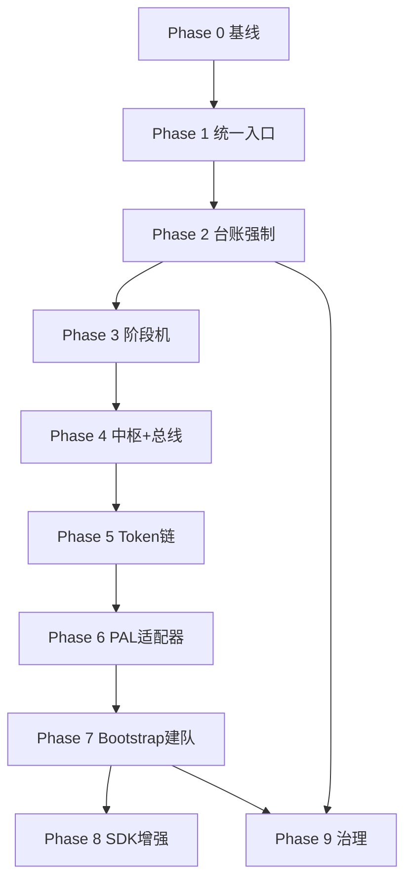

# AWI 运行时改善规划

**版本**: 0.2.0-draft  
**日期**: 2026-06-15  
**状态**: 已批准待执行  
**北极星**: [`RAINDEER-AWI-NORTHSTAR.md`](./RAINDEER-AWI-NORTHSTAR.md) — 导入后用户只对话中枢；跨平台多 Agent 全自动；Raindeer-AWI 全约束零提醒  
**关联**: ADR-001、`docs/FLOW-MODE.md`、`harness/pipeline-dag.json`、`agents/contracts/agent-tool-contracts.json`

---

## 0. 北极星对齐声明

本规划的唯一验收标准：**实现北极星 §10 的 S1–S7 场景**。

用户目标（摘要）：

1. `bootstrap` 导入后，Trae / Cursor / Codex / Claude Code 等均可按同一套 Raindeer-AWI 编排；
2. 项目文件夹内**多会话 Agent 团队**（模型、身份、职责）自动布置，本地 skills 自动注册；
3. 用户**只与中枢调度（Hub）**对话，worker 只干活不对用户；
4. Harness、心流、任务树、台账、Token 压缩、门禁、安全区**全程遵循**，任何文件与约束不被架空；
5. **不需要用户提醒**协议——Compliance Kernel 代行。

施工模型：**L1 协议（已有）→ L2 Compliance Kernel → L3 中枢编排 → L0 平台适配器 → Bootstrap `-ProvisionTeam`**。

---

## 1. 背景与问题陈述

AWI / Raindeer 在**协议层**已具备较完整的 Harness 五子系统（Instructions / State / Verification / Scope / Lifecycle），并吸收了多 Agent 协作、DAG 门禁、心流模式、任务树治理等设计。但在**实际项目执行**中，代理往往：

- 不读取或未按序读取 `FLOW-MODE.md`、`TASK_TREES.md`、`pipeline-dag.json` 等关键文件；
- 跳过 `INTAKE → RESEARCH → PLAN` 直接进入实现；
- 不更新 `workflow-state.json`、`PROJECT_STATUS.md` §5 台账；
- 将 `agents/*.md` 当作可选人设，而非可执行的协作契约；
- 在单会话内完成所有工作，无法复现「规划 Agent ↔ 开发 Agent 异步协作」的流水线价值。

**根因归纳**（非文档质量问题，而是架构分层问题）：

| 现象 | 根因 |
|------|------|
| 规则写了但不遵守 | 契约是 Markdown/JSON，**无运行时强制层** |
| Raindeer 与 AWI 各管各的 | **缺少统一会话入口契约** |
| 多 Agent 协议闲置 | **无跨会话投递层**（Codex `send_message` 等价物缺失） |
| 台账长期为空 | **无合规检查**，违反零成本 |
| 技能路由不稳定 | **opt-in 加载**，无 boot-time 路由器 |

本规划目标：在**不推翻现有协议**的前提下，建设 **Raindeer Control Plane（L2+L3+L0）**，使 AWI 从「手册驱动」升级为「导入即可用的多 Agent 操作系统」。

---

## 2. 目标与非目标

### 2.1 目标（= 北极星可度量子集）

1. **Hub-Only UX**：用户仅与 **`orchestrator`** 会话交互（`agents/orchestrator.md`）；`agents/` 下其余 17 个角色均为 worker，禁止直接向用户输出（`blocked` 经 orchestrator 转述）。
2. **一键建队**：`bootstrap.ps1 -ProvisionTeam default` 扫描 `agents/*.md`，为 orchestrator + 全部 worker 生成 registry、mailbox、worklogs、平台绑定。
3. **跨平台同协议**：`generic` 适配器 100% 可用；Cursor/Codex/Claude Code/Trae 为增强适配器。
4. **Compliance Kernel**：sessionStart / post-edit / gate / token-budget 自动执行，协议零提醒。
5. **全 Harness 遵循**：§5 台账、workflow-state、TASK_TREES、FLOW-MODE、验证链、压缩技能链自动触发。
6. **中枢编排闭环**：orchestrator 按路由向所需 worker 投递任务（非固定三角）；mailbox 或平台 `send_message` 等价物。

### 2.2 非目标（本规划周期内不做）

- 重写 `AGENTS.md` 全文；
- 自建完整 GitNexus 式 DAG Runner（仅轻量 `gate-runner`）；
- 要求所有平台 100% 零点击创建 UI 会话（允许 semi-auto 清单 + registry）；
- 替换各 IDE 原生 Agent 运行时；
- 迁移历史会话到 registry（仅新 bootstrap 项目）。

---

## 3. 设计原则

1. **协议优先，运行时增量**：新能力优先扩展 `harness/` 与 `skills/`，不破坏 CONSTITUTION 优先级链。
2. **渐进式强制**：P0 告警 → P1 阻断关键路径 → P2 自动化编排；避免一次性过重 Hook 导致开发体验崩溃。
3. **单前台主线不变**：多 Agent 团队服从 `TASK_TREES.md` 单主线规则；并行仅用于不共享写冲突的子流水线。
4. **文件即总线**：跨平台、可 git 追溯、Codex/Cursor 均可读写；平台 API 到位后做 adapter，不换协议。
5. **可验证交付**：每阶段有明确验收命令与证据字段，写入 §5 台账。

---

## 4. 目标架构（Raindeer Control Plane）

```
L4  Human Surface     用户 ◄──► orchestrator（agents/orchestrator.md，唯一）
         │
L3  Orchestration     orchestrator → agents/ 下按需 worker 子集（mailbox 或 PAL）
         │
L2  Compliance Kernel sessionStart │ gate-runner │ compliance-check │
                       token-budget │ FLOW-MODE 白名单 │ ledger 强制
         │
L1  Protocol（已有）  AGENTS / FLOW-MODE / TASK_TREES / harness / skills
         │
L0  Platform Adapters generic（必选）│ cursor │ codex │ claude-code │ trae
```

| 层级 | 关键交付物 |
|------|-----------|
| L2 | `SESSION_BOOT.md`、`compliance-check.ps1`、`gate-runner.ps1`、`token-budget.json`、hooks |
| L3 | `agent-registry.json`（= agents/ 全 roster）、mailbox、orchestrator 契约、worker 契约、`$agent-team-bootstrap` |
| L0 | `harness/adapters/{platform}/`、`platform-binding.json` |
| Bootstrap | `bootstrap.ps1 -ProvisionTeam` 串联 L0–L3 初始化 |

---

## 5. 分阶段路线图

### Phase 0 — 基线与度量（1–2 天）

**目的**：建立改善前的可量化基线，避免「感觉变好了」却无证据。

| 交付物 | 说明 |
|--------|------|
| `docs/ENGINEERING/AWI-COMPLIANCE-BASELINE.md` | 记录当前典型 3 类任务（小修/功能/TDD）中协议遵循率 |
| `harness/compliance-check.ps1` | 只读检查：git diff 存在时 §5 是否更新、`workflow-state.active_workflow` 是否为空等 |
| `TASK_TREES.md` 登记 `TREE-RT` | 本改善主线进入 Active Trees |

**验收标准**：

```powershell
.\harness\compliance-check.ps1 -TargetPath .
# 输出 JSON/Markdown 报告，exit 0=通过，1=有违规项（仅报告，不阻断）
```

---

### Phase 1 — 统一会话入口（P0，约 3–5 天）

**问题对应**：上下文预加载不执行、Raindeer/AWI 双轨分裂。

| # | 任务 | 交付物 | 验收 |
|---|------|--------|------|
| 1.1 | 编写最小启动契约 | `docs/SESSION_BOOT.md`（≤800 tokens） | 含：当前 TREE、心流是否激活、必更新文件清单、禁止事项 |
| 1.2 | 精简规则上收 | 更新 `AGENTS-lite.md`：增加 SESSION_BOOT 引用、§5 台账硬约束、FLOW-MODE 停止白名单摘要 | 新会话仅读 lite + boot 即可开工 |
| 1.3 | Cursor Hook：sessionStart | `.cursor/hooks.json` + `harness/hooks/session-start.ps1` | 新 Agent 会话自动注入 boot 摘要路径 |
| 1.4 | 更新 context-preload | `docs/context-preload.md` 与 SESSION_BOOT 对齐，删除重复项 | 单一预加载序列文档 |
| 1.5 | orchestrator 引导 | `agents/orchestrator.md` 增加「首回合必须读 SESSION_BOOT」 | 人工抽查 1 次复杂任务 |

**非目标**：不在此阶段实现 mailbox 或 SDK。

---

### Phase 2 — 状态与台账强制（P0，约 3–5 天）

**问题对应**：`workflow-state.json` 空置、§5 台账不更新。

| # | 任务 | 交付物 | 验收 |
|---|------|--------|------|
| 2.1 | 台账写入模板 | `harness/templates/ledger-entry.md` | 字段：时间、动作、文件、测试、结论 |
| 2.2 | post-edit 提醒 Hook | `.cursor/hooks.json` + `harness/hooks/post-edit-remind.ps1` | 有未登记 diff 时在 agent 侧提示（soft） |
| 2.3 | schedule 集成 | `harness/schedule.json` 增加每日 `compliance-check` | `$schedule` 可列出到期检查 |
| 2.4 | workflow-state 写入规范 | `harness/workflow-state.json` 注释 + `docs/ENGINEERING/WORKFLOW-STATE-GUIDE.md` | 阶段切换必填字段文档化 |
| 2.5 | CI 可选门禁 | `harness/ci-cd-template.yml` 增加 compliance job（warn 模式） | PR 上可见合规报告 |

**升级路径**：连续 2 周 soft 提醒后，将 CI job 从 `warn` 改为 `fail`（仅对 `harness/`、`docs/PROJECT_STATUS.md` 变更 PR）。

---

### Phase 3 — 轻量阶段机与门禁检测（P1，约 5–7 天）

**问题对应**：DAG/gates 无 runner，阶段可随意跳过。

| # | 任务 | 交付物 | 验收 |
|---|------|--------|------|
| 3.1 | Gate 状态 API（脚本） | `harness/gate-runner.ps1` | 输入：workflow + from_phase + to_phase；输出：待满足 gate 列表 |
| 3.2 | 与 pipeline-dag 对齐 | 更新 `pipeline-dag.json` gate id 与 `workflow-gates.md` 交叉引用表 | id 一一对应 |
| 3.3 | Skill：`$workflow-phase-advance` | `skills/workflow-phase-advance/SKILL.md` | 代理切换阶段前必须调用：列 gate → 填证据 → 写 workflow-state |
| 3.4 | boot-time 路由 | 更新 `skills/omo-agent-router/SKILL.md`：复杂任务首步强制输出路由表 | 路由结果写入 worklog |

**验收标准**：模拟一次「跳过 RESEARCH 直接 EXECUTE」，`gate-runner.ps1` 报告 FAIL。

---

### Phase 4 — 中枢 + 多 Agent 总线（P1，约 7–10 天）

**问题对应**：用户只对话 Hub；worker 自动协作；视频方案注册表/消息/worklog。

| # | 任务 | 交付物 | 验收 |
|---|------|--------|------|
| 4.1 | Agent 注册表 | `agent-registry.json` + `AGENT-REGISTRY-SPEC.md` | 自动从 `agents/*.md` 生成；orchestrator + 17 worker |
| 4.2 | 消息协议 | `harness/mailbox/README.md` | 结构化 msg_id；`to` 为任意 worker role_id |
| 4.3 | orchestrator 契约 | `agents/orchestrator.md` | 唯一对用户接口；持有完整 worker roster |
| 4.4 | Worker 契约 | `agents/*.md`（除 orchestrator） | 各文件增补：禁止对用户说话；inbox 优先 |
| 4.5 | `$agent-team-bootstrap` | skill 文件 | 扫描 agents/ 登记 registry + 各角色初始化边界消息 |
| 4.6 | team-pipeline 中枢模式 | 更新 skill | orchestrator 驱动多 worker 流水线 |
| 4.7 | worklogs | `harness/worklogs/{role_id}.md` | 与 agents/ 文件名一一对应 |

**团队 roster**：不另造角色——**`agents/orchestrator.md` = 中枢；其余 `.md` = worker**（见北极星 §4.1）。

---

### Phase 5 — Token 预算与压缩链（P1，约 3–5 天）

**问题对应**：Token 压缩等技能需用户记得调用。

| # | 任务 | 交付物 | 验收 |
|---|------|--------|------|
| 5.1 | Token 预算配置 | `harness/token-budget.json` | 阈值 70%/85% + 技能链定义 |
| 5.2 | Kernel 集成 | `harness/hooks/token-budget-check.ps1` | 超 70% 自动建议 continuity；85% 强制 handoff |
| 5.3 | Worker 间压缩 | mailbox 可选 `compress: lite` 字段 | 降低 worker 间消息 token |
| 5.4 | 文档 | `SESSION_BOOT.md` 引用 | 用户无需知晓 `$caveman-token-compress` |

---

### Phase 6 — 平台适配器 PAL（P1–P2，约 10–14 天）

**问题对应**：Trae/Cursor/Codex/Claude Code 跨平台同协议。

| # | 任务 | 交付物 | 验收 |
|---|------|--------|------|
| 6.1 | generic 适配器 | `harness/adapters/generic/` | mailbox-only；任何平台可跑 S1 |
| 6.2 | Cursor 适配器 | `harness/adapters/cursor/` | hooks + rules + SDK send（可选） |
| 6.3 | Codex 适配器 | `harness/adapters/codex/` | send_message 映射到 mailbox 协议 |
| 6.4 | Claude Code 适配器 | `harness/adapters/claude-code/` | AGENTS.md/CLAUDE.md 指针 + mailbox |
| 6.5 | Trae 适配器 | `harness/adapters/trae/` | `.trae/rules` + skills 注册生成 |
| 6.6 | PAL 调度 | `harness/adapters/Invoke-PlatformAdapter.ps1` | `-Platform auto` 检测并调用 |
| 6.7 | platform-binding | `harness/platform-binding.json` | 记录当前平台与 adapter 版本 |

**原则**：generic 先达标；各平台 adapter 不得修改 L1 协议，只做 L0 翻译。

---

### Phase 7 — Bootstrap 一键建队（P1，约 5–7 天）

**问题对应**：导入后自动多会话、配模型、布身份、导 skills。

| # | 任务 | 交付物 | 验收 |
|---|------|--------|------|
| 7.1 | 扩展 bootstrap | `bootstrap.ps1 -ProvisionTeam` | 串联 Phase 1–6 产物初始化 |
| 7.2 | team manifest | `harness/team-manifest.default.json` | 与 `agents/*.md` 同步的 18 角色清单（1 orchestrator + 17 worker） |
| 7.3 | orchestrator 首条消息模板 | `harness/templates/orchestrator-init-prompt.md` | 导入后复制到 orchestrator 会话即可开工 |
| 7.4 | Skills 平台注册 | adapter `register_skills()` | Cursor rules / Trae `.trae/` 等 |
| 7.5 | post-bootstrap 验证 | `compliance-check.ps1 -Mode post-bootstrap` | 导入后一键体检 |
| 7.6 | README 更新 | `README.md` Quick Start | 文档化「只对话 orchestrator」工作流 |

```powershell
.\bootstrap.ps1 -TargetPath . -Mode full -ProvisionTeam default -Platform auto
```

---

### Phase 8 — SDK / 原生 API 增强（P2，可选）

| # | 任务 | 交付物 | 验收 |
|---|------|--------|------|
| 8.1 | Cursor SDK 编排 | `harness/orchestration/run-team.ps1` | Hub 无人值守轮询 mailbox + SDK resume |
| 8.2 | Codex 全自动循环 | codex adapter 增强 | 原生 send_message 闭环 |
| 8.3 | 文档 | `CURSOR-SDK-TEAM-ORCHESTRATION.md` | 与北极星 S5 跨平台切换对齐 |

回退：100% 使用 generic mailbox + Hub 手动/半自动轮询。

---

### Phase 9 — 持续治理（P2，持续）

| # | 任务 | 说明 |
|---|------|------|
| 9.1 | ADR-002 | Control Plane + PAL + Compliance Kernel 架构决策 |
| 9.2 | 北极星 S1–S7 回归套件 | 每次发版跑一遍场景清单 |
| 9.3 | `$session-retro` / feature_list | 合规率复盘 |
| 9.4 | 扩展团队模板 | 自媒体组、纯 TDD 组等 manifest 变体 |

---

## 6. 里程碑与时间线（建议）

| 里程碑 | 阶段 | 目标 | 成功标志（北极星场景） |
|--------|------|------|------------------------|
| M0 | Phase 0 | +2d | compliance-check 可运行 |
| M1 | Phase 1–2 | +2w | L2 内核：boot + ledger 强制 |
| M2 | Phase 3 | +3w | S2：非法阶段跳转被 gate-runner 拒绝 |
| M3 | Phase 4–5 | +5w | S1：orchestrator 驱动多 worker 闭环；S4：token 自动压缩 |
| M4 | Phase 6–7 | +8w | S5：generic + 1 个平台 adapter；`-ProvisionTeam` 一键导入 |
| M5 | Phase 8–9 | +12w | S6–S7；SDK/原生 API 增强可选 |

**终极验收**：新用户执行 `bootstrap -ProvisionTeam` 后，**只打开 orchestrator 会话**即可完成一个功能从定档到验收，全程无协议提醒。

---

## 7. 风险与缓解

| 风险 | 严重度 | 缓解 |
|------|--------|------|
| Hook 过多导致 Agent 变慢 | 中 | sessionStart 只注入路径摘要，不注入全文；post-edit 仅提醒 |
| 台账形式主义 | 中 | 模板精简；compliance 只检查「有变更必有条目」 |
| 文件总线与 git 冲突 | 低 | mailbox 消息 `processed/` 归档；inbox 仅保留未处理 |
| Cursor 无 send_message | 高 | Phase 4 文件总线为主路径；SDK 为增强 |
| 代理仍不读 SESSION_BOOT | 中 | Hook 强制 + orchestrator 首步检查清单 |
| 与心流模式冲突（不停询问） | 低 | SESSION_BOOT 明确：合规同步不算停止点 |

---

## 8. 验收指标（改善是否有效）

| 指标 | 基线（估） | M3 目标 | M5 目标（北极星） |
|------|-----------|---------|-------------------|
| 有代码变更时会话 §5 更新率 | ~0% | ≥70% | ≥90% |
| 用户协议提醒次数 / 功能 | 多次 | ≤2 | **0** |
| Hub-Only（worker 不对用户说话） | 未定义 | ≥80% | 100%（17 worker 全覆盖） |
| bootstrap 后建队成功率 | 0% | generic 100% | ≥1 平台 adapter 全自动 |
| 三 Agent 循环人工中转 / 版本 | N/A | ≤3 | ≤1（仅定档） |

度量方式：`compliance-check.ps1` 周报 + 手动抽查 2 个任务树闭环。

---

## 9. 文件变更清单（预测）

### 新增

```
docs/ENGINEERING/RAINDEER-AWI-NORTHSTAR.md          # 北极星（已建）
docs/SESSION_BOOT.md
docs/ENGINEERING/AWI-COMPLIANCE-BASELINE.md
docs/ENGINEERING/WORKFLOW-STATE-GUIDE.md
docs/ENGINEERING/AGENT-REGISTRY-SPEC.md
docs/ENGINEERING/CURSOR-SDK-TEAM-ORCHESTRATION.md
docs/adr/ADR-002-control-plane.md                   # Phase 9
harness/compliance-check.ps1
harness/gate-runner.ps1
harness/token-budget.json
harness/agent-registry.json
harness/platform-binding.json
harness/team-manifest.default.json
harness/mailbox/README.md
harness/worklogs/.gitkeep
harness/adapters/generic/
harness/adapters/cursor/
harness/adapters/codex/
harness/adapters/claude-code/
harness/adapters/trae/
harness/adapters/Invoke-PlatformAdapter.ps1
harness/templates/ledger-entry.md
harness/templates/orchestrator-init-prompt.md
harness/scripts/Build-AgentRegistryFromAgentsDir.ps1   # 从 agents/ 生成 registry
harness/hooks/session-start.ps1
harness/hooks/post-edit-remind.ps1
harness/hooks/token-budget-check.ps1
skills/agent-team-bootstrap/SKILL.md
skills/workflow-phase-advance/SKILL.md
.cursor/hooks.json
.cursor/rules/raindeer-awi-orchestrator.mdc            # orchestrator 专用规则
```

### 修改

```
bootstrap.ps1                    # -ProvisionTeam -Platform
AGENTS-lite.md
README.md
docs/context-preload.md
docs/TASK_TREES.md
docs/PROJECT_STATUS.md
skills/team-pipeline/SKILL.md
skills/omo-agent-router/SKILL.md
agents/orchestrator.md
agents/*.md                    # 除 orchestrator 外全部 worker 契约增补
harness/schedule.json
harness/ci-cd-template.yml
harness/feature_list.json
```

---

## 10. 执行顺序与依赖



**下一原子动作**：

1. Phase 0：`harness/compliance-check.ps1`
2. Phase 1：`docs/SESSION_BOOT.md`（含 orchestrator-Only 公理 A4）
3. Phase 7 预研：`Build-AgentRegistryFromAgentsDir.ps1` + `team-manifest.default.json`

---

## 11. 与外部方案（Codex 多 Agent 视频）的对照

| 视频能力 | 本规划落点 | 阶段 |
|----------|-----------|------|
| Agent 注册表 | `agent-registry.json` | Phase 4 |
| send_message | `harness/mailbox/` JSON 消息 | Phase 4 |
| 规划↔开发自动循环 | `team-pipeline` 文件总线模式 | Phase 4 |
| 一键建队 Skill | `$agent-team-bootstrap` | Phase 4 |
| worklog / workspace | `harness/worklogs/` | Phase 4 |
| 领导追溯 | orchestrator + auditor 读 mailbox/worklog | Phase 4 |
| 原生跨会话 API | Cursor SDK adapter | Phase 5 |

---

## 12. 审批与修订

| 版本 | 日期 | 变更 |
|------|------|------|
| 0.1.0-draft | 2026-06-15 | 初稿：问题诊断 + 六阶段路线图 |
| 0.2.0-draft | 2026-06-15 | 对齐北极星：Hub-Only、PAL、Compliance Kernel、Bootstrap 建队、Phase 5–9 |
| 0.2.1-draft | 2026-06-15 | roster = agents/ 全量；orchestrator 唯一对用户；worker = 其余 17 角色 |

修订规则：阶段交付完成后更新本文「成功标志」与 §8 指标实测值；重大架构变更需新增 ADR。
